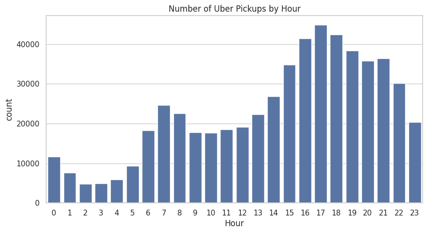

# Urban Mobility Pattern Analysis Using Ride-Hailing Data for Service Optimization
-Project Overview

This project analyzes ride-hailing data to understand urban mobility patterns based on time and location. The objective is to identify peak demand periods and high-traffic areas to support data-driven decision-making in transportation services.

-Dataset

The dataset used in this project contains historical ride-hailing pickup data, including timestamps and geographic coordinates (latitude and longitude).
Although the dataset is from 2014, the observed mobility patterns remain relevant for modern ride-hailing platforms.
https://www.kaggle.com/datasets/fivethirtyeight/uber-pickups-in-new-york-city

-Tools & Technologies

Python (Pandas, Matplotlib, Seaborn), Google Colab

-Data Analysis Process
1. Data Cleaning
Converted timestamp to datetime format
Extracted Hour, Day, and Weekday features
Removed duplicate records (7,749 entries)
Checked for missing values

2. Exploratory Data Analysis (EDA)
Analyzed pickup trends by hour
Compared weekday vs weekend usage
Visualized geographic pickup distribution

-Data Visualization & Insights
1. Pickup by Hour

The distribution of ride-hailing pickups shows a clear increase starting in the morning and peaking in the evening (around 17:00–18:00). This indicates strong commuting patterns, where users rely on ride-hailing services primarily for work-related travel.

2. Pickup by Day

Pickups are more frequent on weekdays compared to weekends, suggesting that the service is mainly used for daily mobility such as commuting to work. Lower activity on weekends reflects reduced professional travel demand.

3. Pickup Density Map

The geographic distribution reveals that most pickups are concentrated in central urban areas. This highlights zones with high economic and social activity, where transportation demand is consistently strong
